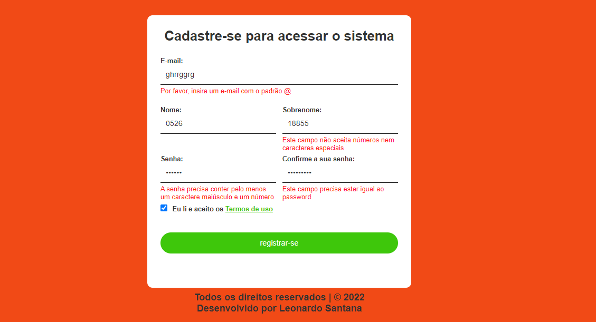

## Sobre o projeto:

Projeto de um formulário de inscrição desenvolvido em HTML5, CSS3 e JavaScript, onde o objetivo é mostrar ao usuário mensagens de erros para o usuário se ele digitar os caracteres não válidos nos campos. Na parte do JavaScript, para informar ao usuário se os campos foram preenchidos incorretamente, a Orientação a Objetos foi usado para este projeto. 

## Tecnologias utilizadas:

- HTML5, 
- CSS3 e 
- JavaScript;

## Layout do projeto:

## Link do projeto:

https://lsantana95.github.io/Formulario-de-inscricao/

## Autor:

Onde me encontrar?

- Entrar em contato comigo:
  
  https://lsantana95.github.io/RocketLinks/ 
